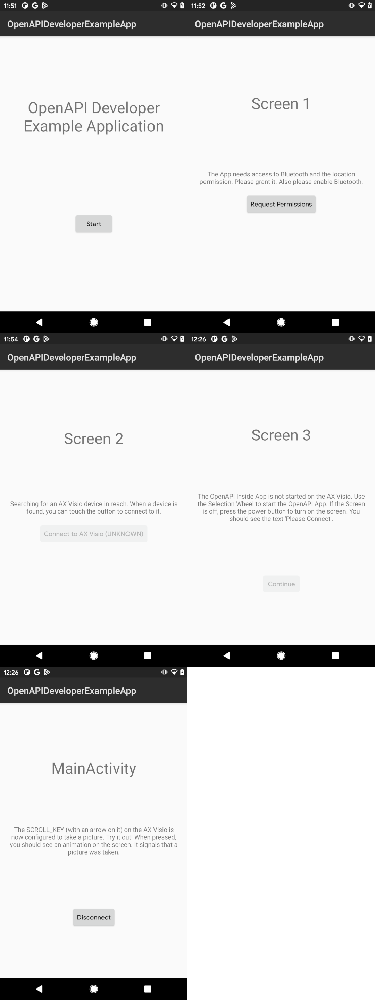

# OpenAPI Developer Example Application

This is a minimal Android Application to show the usage of the OpenAPI provided
by the *SO Comm SDK*. That the application uses only a very small feature of
the OpenAPI is intentional. The app showcases instead the necessary steps,
UI screens and code to guide the user

* to grant the necessary Android Permissions to the app and enable Bluetooth,
* to connect to the Falke using the SDK
* to start the OpenAPI app with the selection wheel

Only after these setup steps are completed, the OpenAPI and other contexts can
be used.

To see all features of the OpenAPI and other contexts, please see the API
reference.

The difference screens and user steps are

# How to use the example code

The code should demonstrate the necessary steps, UI interfaces and user flow to
connect to the Falke and use the OpenAPI. It's intended to be a reference
implementation to look at the code and to copy the relevant parts into your own
application. All the error cases and possibilities are handled. Examples: the
users selects a different app on the selection wheel or the user power down
the Falke. In these cases the app switches back to the relevant screen.

The code is _not_ a showcase of general Android Application development best
practices. For example the app just uses a single activity and the different screens
are shown by simply calling 'setContentView()'. A real world application is expected
to use Android's [Navigation Components](https://developer.android.com/guide/navigation/)
or similar libraries.

Furthermore the UI of the example is very basic. For example there are no
transitions between the different screens. This is sometimes confusing because
the transitions happen not based on user input, but on external events, like
losing the connection to the Falke. A real world application is expected to
provide a better user experience.

For a good user experience some in-process animations are needed. For example
when the app search for available Fakle devices in reach or when the device
connects to a Falke device. Otherwise the user does not know that a operation
is in progress.

# How to build it

Before building the app, you need the OpenAPI API key. It's a JSON web token
that grants your application to specific contexts on the Falke Device.

After receiving the key from Swarovski, add it to the `local.properties` files
as the constant `OPENAPI_API_KEY`. Example:

    $ cat local.properties
    [...]
    sdk.dir=/home/slengfeld/Android/Sdk
    OPENAPI_API_KEY = ey[...]IA

The you can compile the app either with Android Studio or on the commandline

    $ ./gradlew app:assembleDebug

If you see the build error

    FAILURE: Build failed with an exception.

    * Where:
    Build file '.../app/build.gradle.kts' line: 30

    * What went wrong:
    gradleLocalProperties(ro…operty("OPENAPI_API_KEY") must not be null

then the API key is missing. Please add it in the `local.properties` file.

# Open Issues

Currently the libraries of the *SO Comm SDK* are located in the folder `libs/`
has binary artifacts and included locally. In the future these will be
accessible via a maven repository and can be imported after providing a
username and password.
